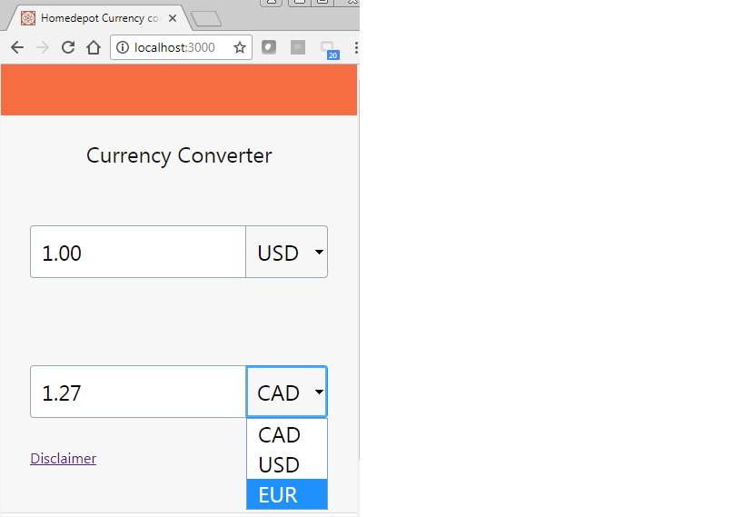
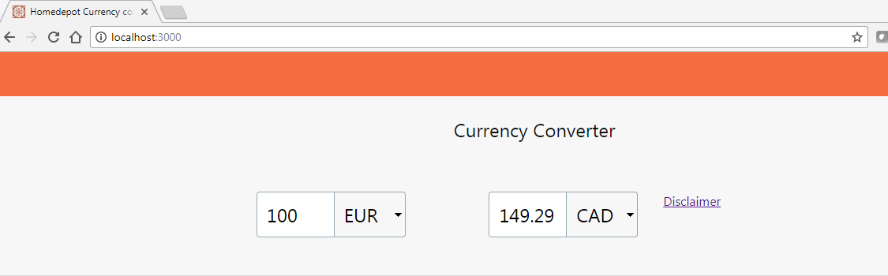

# Custom currency converter

## Features

- [React](https://facebook.github.io/react) 
- [ES6](http://es6-features.org) (with [babel](https://babeljs.io))
-  Redux

#### - Development setup

1.`Download and install NPM Package manager and Git `

2.`git clone https://github.com/ruthra1234/currency-poc.git`

3.`npm install`

4.`jspm install`

5.`npm run dev` - start local dev server with hot-reload and open browser

Mobile View :

Browser :
